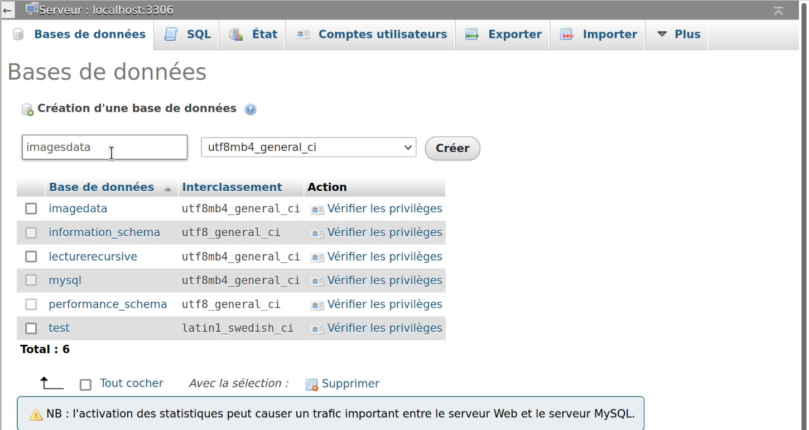
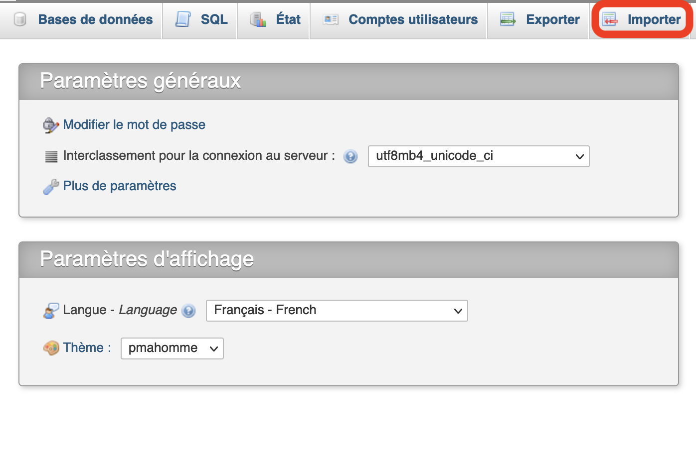

# Sujet : Projet final
## Consigne
La consigne pour ce projet est de reprendre les 3 tps réalisés pour ce cours et d'y ajouter une partie admin pour gérer les images enregistrées. 

Le mot de passe pour se connecter à la partie admin : my-secret-pw

## Exemple d'utilisation

## TPs du cours : 
* https://github.com/Marie-P/tp1_techno_web
* https://github.com/Marie-P/tp2_techno_web
* https://github.com/Marie-P/tp3_techno_web

## Langages
J'ai implémenter le code en utilisant PHP, HTML et CSC.

## Base de données
J'ai utilisé comme système de gestion de base de données mysql.

## Utilisation
#### Attention pour éviter des erreurs :
* Utilier mysql comme base de données !
* Pour lancer le programme par le biais de docker, vérifier que les ports 3306 et 8899 sont bien libre !

#### Mise en place du server mysql et phpmyadmin avec docker
* Installer docker en lançant ./docker/installDocker.sh
* lancer mysql et phpmyadmin avec la commande ./docker/setDocketEnv.sh

#### Mise en place de la base de donnée avec phpmyadmin
* (avec docker) ouvrir dans le navigateur http://localhost:8899/ (sinon) ouvir le phpmyadmin de la machine
* Dans la partie serveur, entrer l'adresse ip (par exemple avec la commande ifconfig docker0 ou ifconfig en0). Exemple ici avec adresse = 111.11.0.1.
   * Serveur : 111.11.0.1:3306
   * Utilisateur : root
   * Mot de passe : my-secret-pw
   * Créer une nouvelle base de données "imagesdata" 
   * Importer la base de données imagesdata.sql dans phpmyadmin. 
   * exécuter le programme : php -S localhost:8000
